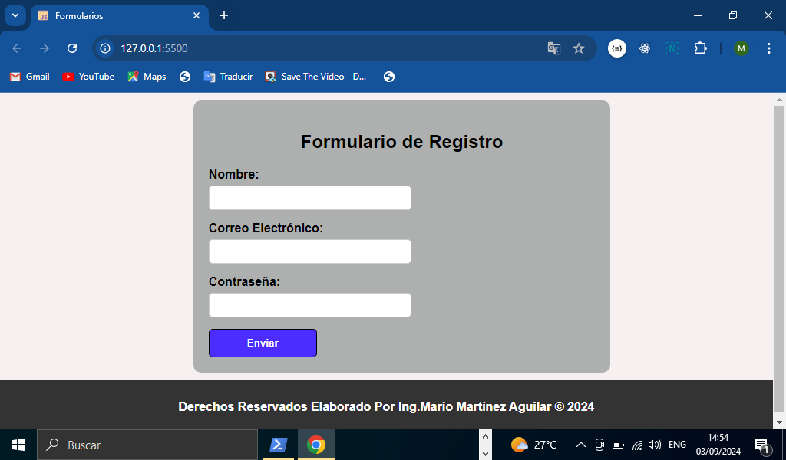
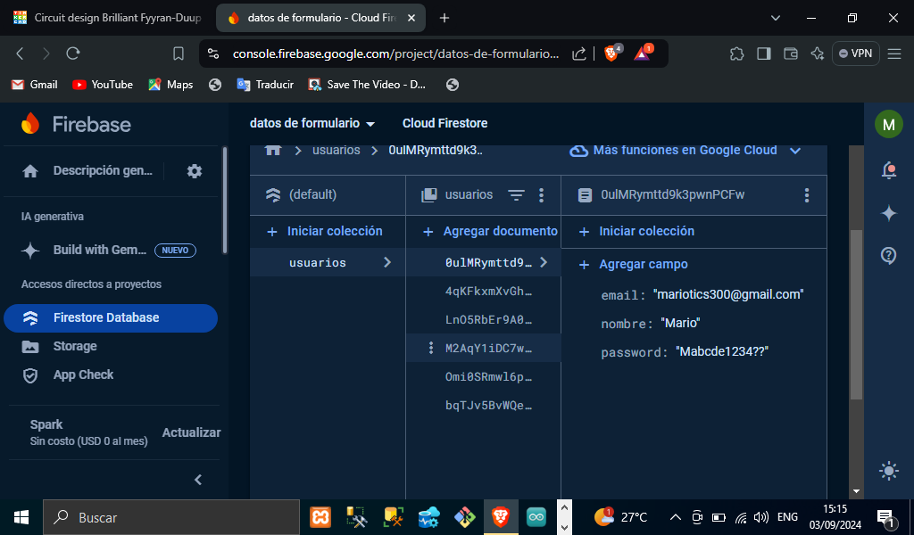

# TITULO DEL PROYECTO    

**Proyecto Validación De Formularios Utilizando JavaScript Y Realizando Una Conexión Con Una Base De Datos De Fire Base Para Mandar La Información Que Contiene El Formulario(nombre,correo y contraseña)**

# DESCRIPCIÓN DEL PROYECTO
**En este proyecto construimos un formulario con sus campos correspondientes así mismo aprendimos a validar cada uno de estos campos con JavaScript, a su vez construimos una base de datos en Firebase es decir en un servidor remoto de esta plataforma que contendrá como información los datos que el usuario mande a través del formulario más adelante explicamos más a detalle.**

# VISTA PREVIA DE COMO SE VE NUESTRO FORMULARIO EN LA PAGINA WEB


# VISTA DE NUESTRA BASE DE DATOS EN FIREBASE CON LOS USUARIOS YA REGISTRADOS


# DESCRIPCCION MAS DETALLADA DEL PROYECTO(Archivo index.html) 

**En nuestro archivo index.html de nuestro repositorio tenemos el código HTML como construimos nuestro formulario podemos observar que tenemos nuestros inputs, etiquetas del formulario así como su id y su name propias de los formularios y el botón para enviar los datos como se muestra a continuación:**
```HTML
<form id="formulario">
            <h2>Formulario de Registro</h2>
            <div class="form-group">
                <label for="name">Nombre:</label>
                <input type="text" id="name" name="name">
                <div class="error-message" id="nameError"></div>
            </div>
            <div class="form-group">
                <label for="email">Correo Electrónico:</label>
                <input type="email" id="email" name="email">
                <div class="error-message" id="emailError"></div>
            </div>
            <div class="form-group">
                <label for="password">Contraseña:</label>
                <input type="password" id="password" name="password">
                <div class="error-message" id="passwordError"></div>
            </div>
            <button type="submit">Enviar</button>
        </form>
```
# DESCRIPCION MAS DETALLADA DEL PROYECTO(Archivo style.css)
**En este archivo de CSS es para darle diseño al formulario con código CSS, es decir definimos los tamaños ,margenes,padding, colores fondo y algunas propiedades CSS para darle más diseño a los inputs y botones como se muestra a continuación solo es una parte del código podemos consultar el código completo en nuestro archivo style.css de nuestro repositorio**

```CSS
input[type="text"],
input[type="email"],
input[type="password"] {
  padding: 5px;
  border-radius: 5px;
  border: 1px solid #ccc;
  width: 50%;
  height: 20px;
}
input:focus{
  background-color: rgb(185, 210, 248);
}
button[type="submit"] {
  padding: 10px 10px;
  background-color:#4c2cff;
  color: #fff;
  border: solid 1px black;
  border-radius: 5px;
  cursor: pointer;
  width: 28%; 
  font-weight: bold;
  display:block;
}
```
# DESCRIPCION MAS DETALLADA DEL PROYECTO(Archivo script.js)
**En este archivo tenemos toda la funcionalidad con JavaScript para poder validar el formulario y así mismo mandarlo a base de datos**

## VALIDACION DEL CAMPO DE CORREO ELECTRONICO
**En esta parte validamos que el usuario ingrese un correo electrónico valido para ello hacemos uso de un patrón básico y lo comparamos con lo que el usuario escribe en el input como se muestra a continuación:**
```JavaScript
    let emailEntrada = document.getElementById('email')
    let emailError = document.getElementById('emailError')
    let emailPattern = /^[^\s@]+@[^\s@]+\.[^\s@]+$/; //Patron de validación
    if(!emailPattern.test(emailEntrada.value)){
        emailError.textContent = 'Por favor, introduce un correo válido'
        emailError.classList.add('error-message')    
    }else{
        emailError.textContent = ''
        emailError.classList.remove('error-message')
    }
```
## VALIDACION DEL CAMPO NOMBRE DEL USUARIO
**En este campo solo validamos que el usuario escribe un nombre valido que no quede vacío como se muestra a continuación:**
```JavaScript
    //Validar Campo nombre
    let entradaNombre = document.getElementById('name')
    let errorname = document.getElementById('nameError')

    if(entradaNombre.value.trim() === ''){
        errorname.textContent = 'Por favor, introduce tu nombre'
        errorname.classList.add('error-message')
    }else{
        errorname.textContent = ''
        errorname.classList.remove('error-message')
    }
```
## VALIDACION DE LA CONTRASENA EN EL FORMULARIO
**En este campo validamos la contraseña que el usuario introduce en el formulario, es decir le decimos que la contraseña debe cumplir con lo siguiente: La contraseña debe tener al menos 8 caracteres, números, mayúsculas , minúsculas y caracteres especiales. Se estableció un patrón de JavaScript como se muestra a continuación:**
```JavaScript
let contrasenaEntrada = document.getElementById('password')
    let contrasenaError = document.getElementById('passwordError')
    let contrasenaPattern = /^(?=.*[a-z])(?=.*[A-Z])(?=.*\d)(?=.*[$@$!%*?&#.$($)$-$_])[A-Za-z\d$@$!%*?&#.$($)$-$_]{8,15}$/;
    if(!contrasenaPattern.test(contrasenaEntrada.value)){
        contrasenaError.textContent = 'La contraseña debe tener al menos 8 caracteres, números, mayúsculas , minúsculas y caracteres especiales'
        contrasenaEntrada.classList.add('error-message')

    }else{
        contrasenaError.textContent = ''
        contrasenaError.classList.add('error-message')
    }
```
## CONEXION A LA BASE DE DATOS(BACKEND FIREBASE)
**Por ultimo debemos hacer una conexión con firebase para poder almacenar la información en la base datos(backend), para ello tenemos que hacer realizar una función que nos conecte la base datos de firebase así como crear una constante que llamamos firebaseConfig que es un objeto que contiene toda la configuración de firebase que nos permita enviar la información correctamente sin problemas de cors o autenticación, consultar el archivo script.js para ver más a detalle la configuración.**

## INICIAR CONEXION CON FIREBASE
**Ya después de haber configurado lo firebase procedemos a iniciar la conexión de la base de datos para eso iniciamos firebase de la siguiente manera:**
```JavaScript
    firebase.initializeApp(firebaseConfig);
    const db = firebase.firestore();
```
## SI LOS DATOS SON CORRECTOS ENVIAR LOS DATOS
**En esta parte validamos que si todos los datos del formulario son correctos que se envíen a la base de datos, por otro lado que el backend recibe esa información como se muestra a continuación:**
```JavaScript
if(!errorname.textContent && !emailError.textContent && !contrasenaError.   textContent){
        //backend que reciba la información
        db.collection("usuarios").add({
            nombre: entradaNombre.value,
            email: emailEntrada.value,
            password: contrasenaEntrada.value
        })
        .then((docRef) => {
            alert ('El Formulario Se Ha Enviado Con Éxito', docRef.id)
            document.getElementById('formulario').reset();
            //console.log("Document written with ID: ", docRef.id)
        })
        .catch((error) =>{
            //console.log("Error adding document: ", error)
            alert (error)    
        });
     }
```
### Lista De Tecnologías Y Herramientas Usadas En Nuestro Proyecto  

1. HTML
2. CSS 
3. JavaScript(Conexión a la base de datos en firebase)
4. Creación de una base de datos en Firebase(Plataforma Firebase)   
5. JavaScript(validación de formularios)
6. Herramienta de Visual Studio Code(live Server)
7. GitHub

*Elaborado Por: Mario Martínez Aguilar*
 

